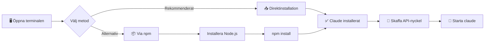

# Installation av Claude Code

I detta kapitel installerar vi Claude Code på din dator.

!!! abstract "Vad du kommer lära dig"
    - Vad Node.js är och varför det behövs
    - Hur du öppnar terminalen på din dator
    - Hur du installerar Claude Code
    - Hur du verifierar att allt fungerar

---

## Översikt: Installationsprocessen



---

## Vad är terminalen?

=== "Nybörjare"

    **Terminalen** (kallas även kommandotolk, konsol eller shell) är ett textbaserat sätt att ge kommandon till datorn. Istället för att klicka på ikoner skriver du instruktioner.

    Det kan kännas gammaldags, men det är faktiskt kraftfullt! Claude Code körs i terminalen, och du kommer snabbt bli bekväm med det.

    ### Öppna terminalen

    === "Windows"

        **Metod 1 - Sök:**

        1. Tryck ++windows++ (Windows-tangenten)
        2. Skriv `terminal` eller `powershell`
        3. Klicka på **Windows Terminal** eller **Windows PowerShell**

        **Metod 2 - Högerklick:**

        1. Högerklicka på Start-knappen
        2. Välj **Terminal** eller **Windows PowerShell**

        !!! tip "Windows Terminal rekommenderas"
            Windows Terminal är modernare och trevligare att använda än äldre PowerShell. Du kan installera det gratis från Microsoft Store om det saknas.

    === "macOS"

        1. Tryck ++cmd+space++ för att öppna Spotlight
        2. Skriv `terminal`
        3. Tryck ++enter++

        Eller navigera till **Program** → **Verktygsprogram** → **Terminal**

    === "Linux"

        - Tryck ++ctrl+alt+t++ (fungerar på de flesta distributioner)
        - Eller sök efter "Terminal" i din programlista

=== "Standard"

    Terminalen är din huvudarbetsyta för Claude Code. Öppna den via:

    - **Windows**: ++windows++ → sök "terminal"
    - **macOS**: ++cmd+space++ → "terminal"
    - **Linux**: ++ctrl+alt+t++

=== "Djupdykning"

    Claude Code fungerar med bash, zsh, PowerShell och de flesta moderna shells. Fish-shell stöds men kan kräva extra konfiguration för autocompletion.

---

## Installationsmetoder

Det finns två sätt att installera Claude Code:

| Metod | Bäst för | Kräver Node.js? |
|-------|----------|-----------------|
| **Direktinstallation** | Snabbaste sättet | Nej |
| **Via npm** | Om du redan har Node.js | Ja |

---

## Metod 1: Direktinstallation (rekommenderas)

=== "Nybörjare"

    Det enklaste sättet att installera Claude Code är med ett enda kommando som hämtar och installerar allt åt dig.

    ### Windows

    1. Öppna **Windows Terminal** eller **PowerShell** (se instruktioner ovan)
    2. Kopiera detta kommando och klistra in (högerklicka för att klistra):

    ```powershell
    irm https://claude.ai/install.ps1 | iex
    ```

    3. Tryck ++enter++ och vänta tills installationen är klar

    !!! info "Vad gör kommandot?"
        - `irm` = "invoke request method" - hämtar filen från internet
        - `|` = "pipe" - skickar resultatet vidare
        - `iex` = "invoke expression" - kör det som hämtades

    ### macOS och Linux

    1. Öppna **Terminal**
    2. Kopiera och klistra in:

    ```bash
    curl -fsSL https://claude.ai/install.sh | bash
    ```

    3. Tryck ++enter++ och vänta

    !!! info "Vad gör kommandot?"
        - `curl` = hämtar filen från internet
        - `-fsSL` = flaggor för att hantera omdirigeringar och fel tyst
        - `|` = "pipe" - skickar resultatet vidare
        - `bash` = kör skriptet

=== "Standard"

    **Windows (PowerShell):**
    ```powershell
    irm https://claude.ai/install.ps1 | iex
    ```

    **macOS/Linux:**
    ```bash
    curl -fsSL https://claude.ai/install.sh | bash
    ```

    **macOS med Homebrew:**
    ```bash
    brew install --cask claude-code
    ```

=== "Djupdykning"

    Direktinstallationen hanterar Node.js-beroenden automatiskt. För företagsmiljöer eller offline-installation, använd npm-metoden med en intern npm-registry.

---

## Metod 2: Via npm (alternativ)

Denna metod kräver att Node.js redan är installerat.

=== "Nybörjare"

    ### Vad är Node.js?

    **Node.js** är en programmeringsmiljö för JavaScript. Tänk på det som en "motor" som kan köra JavaScript-program på din dator. Claude Code är byggt med JavaScript och behöver därför Node.js.

    **npm** (Node Package Manager) är ett verktyg som följer med Node.js och används för att installera program och bibliotek.

    ### Steg 1: Installera Node.js

    1. Gå till [nodejs.org](https://nodejs.org)
    2. Ladda ner **LTS-versionen** (den gröna knappen, "Long Term Support")
    3. Kör installationsfilen och klicka "Next" på alla steg

    ### Steg 2: Verifiera Node.js

    Öppna en **ny** terminal (stäng den gamla först) och skriv:

    ```bash
    node --version
    ```

    Du bör se något som `v20.10.0`. Om du får ett felmeddelande, prova att starta om datorn.

    ### Steg 3: Installera Claude Code

    I terminalen, skriv:

    ```bash
    npm install -g @anthropic-ai/claude-code
    ```

    !!! info "Vad betyder kommandot?"
        - `npm` = Node Package Manager, verktyget för att installera paket
        - `install` = kommandot för att installera något
        - `-g` = "global" - installera så att det fungerar överallt, inte bara i en mapp
        - `@anthropic-ai/claude-code` = namnet på paketet (@ anger organisation)

=== "Standard"

    ```bash
    # Installera Node.js LTS från nodejs.org först

    # Verifiera
    node --version  # Bör vara 18+
    npm --version

    # Installera Claude Code
    npm install -g @anthropic-ai/claude-code
    ```

=== "Djupdykning"

    För mer kontroll över Node.js-versioner, använd en versionshanterare:

    - **Windows**: [nvm-windows](https://github.com/coreybutler/nvm-windows)
    - **macOS/Linux**: [nvm](https://github.com/nvm-sh/nvm) eller [fnm](https://github.com/Schniz/fnm)

    ```bash
    # Med nvm
    nvm install --lts
    nvm use --lts
    npm install -g @anthropic-ai/claude-code
    ```

---

## Verifiera installationen

Efter installationen, kontrollera att allt fungerar:

```bash
claude doctor
```

Detta kommando kontrollerar din installation och visar eventuella problem.

=== "Nybörjare"

    Du bör se en lista med gröna bockar. Om något är rött, följ instruktionerna som visas.

=== "Standard"

    `claude doctor` kontrollerar:

    - Node.js-version
    - Claude Code-installation
    - Nätverksanslutning
    - API-konfiguration

---

## Skaffa API-nyckel

=== "Nybörjare"

    En **API-nyckel** är som ett lösenord som ger Claude Code tillgång till Claudes AI. API står för "Application Programming Interface" - ett sätt för program att prata med varandra.

    ### Skapa din nyckel

    1. Gå till [console.anthropic.com](https://console.anthropic.com)
    2. Skapa ett konto om du inte har ett (du kan logga in med Google)
    3. Klicka på **API Keys** i vänstermenyn
    4. Klicka **Create Key**
    5. Ge nyckeln ett namn (t.ex. "Min dator")
    6. **Kopiera nyckeln direkt!** Du kan bara se den en gång.

    !!! danger "Skydda din API-nyckel"
        - Dela **aldrig** din nyckel med någon
        - Lägg **aldrig** upp den på internet eller i kod som delas
        - Den är kopplad till ditt konto och din betalning
        - Om du tror att den läckt, radera den och skapa en ny

=== "Standard"

    1. Skapa konto på [console.anthropic.com](https://console.anthropic.com)
    2. Navigera till **API Keys** → **Create Key**
    3. Kopiera nyckeln direkt (visas bara en gång)

=== "Djupdykning"

    För produktion och team, överväg:

    - Separata nycklar per miljö (dev/prod)
    - Secrets management (AWS Secrets Manager, HashiCorp Vault)
    - Rate limiting och budget alerts i Anthropic Console

---

## Starta Claude Code

Nu är det dags att köra Claude Code första gången!

=== "Nybörjare"

    1. Öppna terminalen
    2. Skriv:

    ```bash
    claude
    ```

    3. Första gången blir du ombedd att ange din API-nyckel
    4. Klistra in nyckeln (den syns inte när du skriver - det är normalt!)
    5. Tryck ++enter++

    Du bör nu se Claude Codes välkomstmeddelande och en prompt (`>`) där du kan börja skriva.

    !!! success "Grattis!"
        Du har installerat Claude Code och är redo att börja vibe-koda!

=== "Standard"

    ```bash
    claude
    ```

    Ange API-nyckel vid första körningen, eller sätt miljövariabeln först:

    === "Windows (PowerShell)"
        ```powershell
        $env:ANTHROPIC_API_KEY = "din-api-nyckel"
        claude
        ```

    === "macOS/Linux"
        ```bash
        export ANTHROPIC_API_KEY="din-api-nyckel"
        claude
        ```

=== "Djupdykning"

    Miljövariabler kan sättas permanent i:

    - **Windows**: Systeminställningar → Miljövariabler
    - **macOS/Linux**: `~/.bashrc`, `~/.zshrc` eller `~/.profile`

    ```bash
    # Lägg till i din shell config
    export ANTHROPIC_API_KEY="din-api-nyckel"
    ```

---

## Felsökning

??? question "Kommandot 'claude' hittades inte"

    **Prova först:** Stäng terminalen och öppna en ny.

    **Om det fortfarande inte fungerar:**

    Installationen kan ha lagt Claude Code på en plats som inte finns i din PATH (listan över mappar där datorn letar efter program).

    Kör detta för att se var npm installerade:
    ```bash
    npm config get prefix
    ```

    På Windows, lägg till `\bin` efter sökvägen och lägg till den i PATH via Systeminställningar.

??? question "Autentiseringsfel eller 'Invalid API key'"

    1. Kontrollera att du kopierade hela nyckeln (den börjar med `sk-ant-`)
    2. Skapa en ny nyckel i [Anthropic Console](https://console.anthropic.com)
    3. Sätt om nyckeln:

    ```bash
    claude config set apiKey
    ```

??? question "Node.js-versionen är för gammal"

    Claude Code kräver Node.js 18 eller senare.

    Kontrollera din version:
    ```bash
    node --version
    ```

    Om versionen är lägre än 18, ladda ner senaste LTS från [nodejs.org](https://nodejs.org).

??? question "'Permission denied' eller 'EACCES' på macOS/Linux"

    npm försöker installera på en plats du inte har rättigheter till.

    **Lösning 1:** Använd direktinstallationen istället (se ovan)

    **Lösning 2:** Konfigurera npm att installera i din hemkatalog:
    ```bash
    mkdir ~/.npm-global
    npm config set prefix '~/.npm-global'
    echo 'export PATH=~/.npm-global/bin:$PATH' >> ~/.bashrc
    source ~/.bashrc
    ```

---

## Nästa steg

Nu när Claude Code är installerat är du redo att skapa ditt [första projekt](forsta-projektet.md)!
