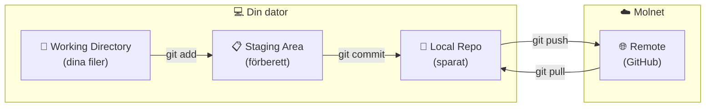

# Grundläggande Git

Här lär du dig de viktigaste Git-kommandona för att spåra dina ändringar.

!!! abstract "Vad du kommer lära dig"
    - Hur du installerar och konfigurerar Git
    - Arbetsflödet: add → commit → push
    - De vanligaste kommandona du behöver varje dag
    - Hur du ångrar ändringar om något går fel

---

## Installera Git

=== "Windows"

    1. Ladda ner från [git-scm.com](https://git-scm.com/download/win)
    2. Kör installationsfilen
    3. Acceptera standardinställningarna (de fungerar bra)

    **Verifiera:**
    ```powershell
    git --version
    ```

=== "macOS"

    Git kommer förinstallerat. Om det saknas:

    ```bash
    # Via Homebrew (rekommenderas)
    brew install git

    # Eller via Xcode Command Line Tools
    xcode-select --install
    ```

=== "Linux"

    ```bash
    # Debian/Ubuntu
    sudo apt install git

    # Fedora
    sudo dnf install git
    ```

---

## Konfigurera Git

Första gången behöver du ange ditt namn och email:

```bash
git config --global user.name "Ditt Namn"
git config --global user.email "din@email.se"
```

!!! info "Varför?"
    Varje commit sparar vem som gjorde ändringen. Detta är din "signatur" på ditt arbete.

---

## Skapa ett repository

=== "Nybörjare"

    Ett **repository** (repo) är din projektmapp med Git aktiverat.

    ```bash
    # Gå till din projektmapp
    cd mitt-projekt

    # Aktivera Git
    git init
    ```

    Du ser meddelandet "Initialized empty Git repository". Nu spårar Git denna mapp!

=== "Standard"

    ```bash
    # Nytt projekt
    mkdir nytt-projekt && cd nytt-projekt
    git init

    # Eller klona befintligt
    git clone https://github.com/user/repo.git
    ```

=== "Djupdykning"

    `git init` skapar en `.git/`-mapp med:

    - `objects/` - Alla commits, filer, trees
    - `refs/` - Branch-pekare
    - `HEAD` - Nuvarande branch
    - `config` - Repo-specifik konfiguration

---

## De fyra stegen



=== "Nybörjare"

    1. **Working Directory** - Dina filer som du jobbar med
    2. **Staging Area** - Filer du valt att inkludera i nästa commit
    3. **Local Repo** - Sparade commits på din dator
    4. **Remote** - Kopia på GitHub (backup + delning)

=== "Standard"

    | Område | Kommando för att flytta dit |
    |--------|----------------------------|
    | Working → Staging | `git add` |
    | Staging → Local | `git commit` |
    | Local → Remote | `git push` |
    | Remote → Local | `git pull` |

---

## Grundläggande arbetsflöde

### 1. Se status

```bash
git status
```

Visar vilka filer som ändrats, vilka som är redo för commit, etc.

### 2. Lägga till filer (staging)

```bash
# Lägg till en specifik fil
git add index.html

# Lägg till alla ändrade filer
git add .
```

### 3. Skapa en commit

```bash
git commit -m "Lade till navigeringsmeny"
```

=== "Nybörjare"

    Meddelandet efter `-m` ska kort beskriva vad du ändrade. Skriv det som en handling:

    - ✅ "Lade till kontaktformulär"
    - ✅ "Fixade bugg i beräkningen"
    - ❌ "Uppdateringar" (för vagt)
    - ❌ "asdfasdf" (meningslöst)

=== "Standard"

    **Bra commit-meddelanden:**

    ```
    # Format
    <typ>: <kort beskrivning>

    # Exempel
    feat: Lade till möjlighet att filtrera produkter
    fix: Korrigerade datumformatering i rapporten
    docs: Uppdaterade installationsinstruktioner
    ```

=== "Djupdykning"

    **Conventional Commits:**

    ```
    <type>(<scope>): <description>

    [optional body]

    [optional footer]
    ```

    Typer: `feat`, `fix`, `docs`, `style`, `refactor`, `test`, `chore`

### 4. Se historik

```bash
# Visa commit-historik
git log

# Kompakt format
git log --oneline

# Med graf för branches
git log --oneline --graph
```

---

## Ångra ändringar

=== "Nybörjare"

    **Ångra ändringar i en fil (inte committed än):**
    ```bash
    git restore filnamn.txt
    ```

    **Ta bort fil från staging (men behåll ändringarna):**
    ```bash
    git restore --staged filnamn.txt
    ```

=== "Standard"

    | Situation | Kommando |
    |-----------|----------|
    | Ångra ändringar (ej staged) | `git restore fil` |
    | Ta bort från staging | `git restore --staged fil` |
    | Ångra senaste commit (behåll ändringar) | `git reset --soft HEAD~1` |
    | Ångra senaste commit (ta bort ändringar) | `git reset --hard HEAD~1` |

=== "Djupdykning"

    `git restore` (Git 2.23+) ersätter det äldre `git checkout -- fil` för att ångra ändringar. Det är tydligare och mer fokuserat.

    ```bash
    # Ångra alla ändringar i working directory
    git restore .

    # Ångra specifik commit (skapar ny commit)
    git revert <commit-hash>

    # Interaktiv rebase för att redigera historik
    git rebase -i HEAD~3

    # Spara undan ändringar tillfälligt
    git stash
    git stash pop
    ```

---

## Med Claude Code

Du kan be Claude hantera Git åt dig:

```
Skapa en commit med alla ändringar jag gjort
```

```
Visa mig vad som ändrats sedan förra commit
```

```
Ångra senaste ändringen i config.js
```

---

## Prova själv

!!! example "Övning: Ditt första Git-repository"

    1. **Skapa ett övningsprojekt:**
       ```bash
       mkdir git-ovning
       cd git-ovning
       ```

    2. **Initiera Git:**
       ```bash
       git init
       ```

    3. **Skapa en fil:**
       ```bash
       echo "Mitt första Git-projekt" > README.md
       ```

    4. **Se status (filen är "untracked"):**
       ```bash
       git status
       ```

    5. **Lägg till och committa:**
       ```bash
       git add README.md
       git commit -m "Första commit"
       ```

    6. **Se din historik:**
       ```bash
       git log --oneline
       ```

    7. **Gör en ändring och se skillnaden:**
       ```bash
       echo "Nu har jag ändrat filen" >> README.md
       git diff
       ```

    Grattis - du har gjort din första commit!

---

## Sammanfattning

!!! success "Det viktigaste att ta med sig"
    - `git init` aktiverar Git i en mapp
    - Arbetsflödet är: **ändra filer** → `git add` → `git commit`
    - `git status` visar vad som ändrats och vad som är redo att committas
    - `git log` visar historiken över alla commits
    - `git restore` ångrar ändringar som inte committats
    - Claude Code kan hantera Git åt dig om du föredrar det

---

## Nästa steg

Lär dig att lagra ditt projekt på [GitHub](github.md).
