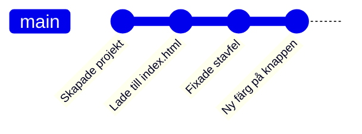
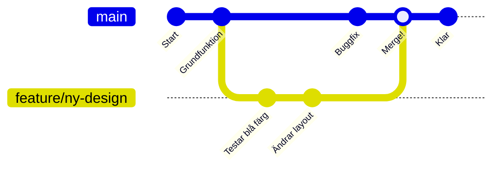

# Vad är Git?

Git är ett versionshanteringssystem som låter dig spåra ändringar i dina filer över tid.

!!! abstract "Vad du kommer lära dig"
    - Varför versionshantering är värdefullt
    - Vad commits och branches är
    - Skillnaden mellan Git och GitHub

---

## Varför versionshantering?

=== "Nybörjare"

    Har du någonsin haft filer som heter så här?

    - `rapport.docx`
    - `rapport_v2.docx`
    - `rapport_final.docx`
    - `rapport_final_FINAL.docx`
    - `rapport_final_VERKLIGEN_FINAL.docx`

    **Git löser detta problem.** Istället för att manuellt skapa kopior, spårar Git alla ändringar automatiskt. Du kan:

    - Se exakt vad som ändrats och när
    - Gå tillbaka till vilken tidigare version som helst
    - Ha flera versioner (grenar) parallellt

=== "Standard"

    Versionshantering ger dig:

    - **Historik** - Se alla ändringar över tid
    - **Ångra** - Återställ till tidigare version
    - **Parallellt arbete** - Jobba med features i separata grenar
    - **Backup** - Din kod finns säkert på flera ställen
    - **Samarbete** - (Om du senare vill jobba med andra)

=== "Djupdykning"

    Git är ett **distribuerat** versionshanteringssystem, vilket innebär att varje klon innehåller hela historiken. Detta skiljer sig från centraliserade system som SVN.

    **Centrala koncept:**

    - **Repository** - Ett projekt med all historik
    - **Commit** - En snapshot av alla filer vid en tidpunkt
    - **Branch** - En oberoende utvecklingslinje
    - **Remote** - En kopia av repot på annan plats (t.ex. GitHub)

---

## Git-konceptet: Commits



=== "Nybörjare"

    En **commit** är som att ta en bild av ditt projekt vid en viss tidpunkt.

    Tänk dig att du tar foton av ditt skrivbord varje dag. Om något går fel kan du titta på gårdagens foto och se hur det såg ut då.

    Varje commit har:
    - **Ett meddelande** som beskriver vad du ändrade
    - **En unik identifierare** (en lång kod med bokstäver och siffror)
    - **Datum och tid**

=== "Standard"

    En commit är en **snapshot** av hela projektet. Git är smart och sparar bara det som faktiskt ändrats (diff).

    ```
    commit a1b2c3d
    Author: Peter
    Date: 2024-01-15

        Lade till kontaktformulär på startsidan
    ```

=== "Djupdykning"

    Git använder SHA-1 hash för att identifiera commits. Varje commit pekar på:

    - En **tree** (mappstruktur)
    - En **parent** (föregående commit, utom första)
    - Metadata (författare, datum, meddelande)

    Detta skapar en **DAG** (Directed Acyclic Graph) av projekthistoriken.

---

## Git-konceptet: Branches



=== "Nybörjare"

    En **branch** (gren) är som en parallell version av ditt projekt.

    **Exempel:** Du vill prova att ändra designen på din webbsida, men du är inte säker på att det blir bra. Med en branch kan du:

    1. Skapa en ny gren (branch)
    2. Experimentera fritt
    3. Om det blev bra: slå ihop (merge) med huvudversionen
    4. Om det inte blev bra: ta bort grenen och inget är förlorat

=== "Standard"

    Branches låter dig jobba med flera features parallellt:

    ```
    main ─────●─────●─────●─────●
                    \           /
    feature/login    ●───●───●
    ```

    - `main` är huvudgrenen (produktionskoden)
    - Feature-branches är för nya funktioner
    - När klart: merge tillbaka till main

=== "Djupdykning"

    I Git är en branch bara en **pekare** till en commit. Detta gör branch-operationer extremt snabba (O(1)).

    ```bash
    # .git/refs/heads/main innehåller bara:
    a1b2c3d4e5f6...  # SHA-1 hash
    ```

    HEAD är en speciell pekare som anger vilken branch du är på.

---

## Git vs GitHub

!!! info "Viktigt att förstå"

    **Git** och **GitHub** är inte samma sak!

    - **Git** = Verktyget som spårar ändringar (körs lokalt)
    - **GitHub** = En webbplats där du kan lagra och dela Git-projekt

| Git | GitHub |
|-----|--------|
| Gratis, open source | Företag (Microsoft) |
| Körs på din dator | Körs i molnet |
| Ingen inloggning | Kräver konto |
| Kommandorad | Webbgränssnitt + API |

Du kan använda Git helt utan GitHub. Men GitHub ger dig:

- Backup i molnet
- Möjlighet att dela kod
- Webbgränssnitt för att se historik
- Issue-tracking, pull requests, m.m.

---

## Sammanfattning

!!! success "Det viktigaste att ta med sig"
    - **Git** spårar alla ändringar i dina filer - ingen mer "final_FINAL.docx"
    - En **commit** är en sparad ögonblicksbild av ditt projekt
    - **Branches** låter dig experimentera utan att riskera din fungerande kod
    - **Git** körs lokalt på din dator, **GitHub** är en molntjänst för delning och backup
    - Du behöver inte förstå allt direkt - börja med grunderna och bygg vidare

---

## Nästa steg

Redo att börja använda Git? Fortsätt till [Grundläggande Git](grundlaggande-git.md).
