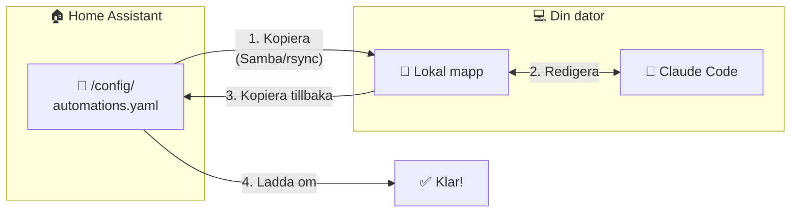

# Arbetsflöde: Sätta upp Claude Code för Home Assistant

Innan du kan använda Claude Code för att skapa automationer måste du få Claude att "se" dina Home Assistant-filer.



---

## Det viktiga: YAML är text!

=== "Nybörjare"

    **Goda nyheter!** Home Assistants konfigurationsfiler är vanliga textfiler (YAML-format). Det betyder att Claude Code kan läsa och redigera dem direkt - till skillnad från t.ex. Excel-filer.

    Men filerna ligger på din Home Assistant-enhet (Raspberry Pi, NUC, etc.), inte på din dator. Du måste därför:

    1. Kopiera filerna till din dator
    2. Arbeta med Claude Code
    3. Kopiera tillbaka ändringarna
    4. Ladda om konfigurationen i Home Assistant

=== "Standard"

    Home Assistant använder YAML (textfiler) för konfiguration. Dessa behöver synkas mellan din HA-installation och din dator där Claude Code körs.

    **Tre huvudmetoder:**

    | Metod | Svårighetsgrad | Bäst för |
    |-------|---------------|----------|
    | Samba-share | Enkel | HAOS med Windows |
    | SSH + rsync | Medium | Alla installationer |
    | File Editor addon | Enklast | Snabba ändringar |

=== "Djupdykning"

    Home Assistants konfiguration lagras vanligtvis i `/config/` (HAOS) eller annan plats beroende på installation. Filerna är YAML som kan versionshanteras med Git.

    **Rekommenderat:** Sätt upp lokal arbetsmapp med Git, synka via rsync/Samba, och håll `secrets.yaml` utanför versionshantering.

---

## Var ligger filerna?

| Installationstyp | Sökväg |
|------------------|--------|
| Home Assistant OS | `/config/` |
| Docker/Container | Där du monterade config-volymen |
| Core | `~/.homeassistant/` |

---

## Metod 1: Samba-share (enklast för Windows)

=== "Nybörjare"

    **Samba** låter dig komma åt Home Assistant-filerna som en nätverksmapp i Utforskaren.

    ### Steg 1: Installera Samba-addon

    1. I Home Assistant, gå till **Inställningar** → **Tillägg**
    2. Klicka **Tilläggsbutik**
    3. Sök efter "Samba share"
    4. Klicka **Installera** och sedan **Starta**

    ### Steg 2: Anslut från Windows

    1. Öppna **Utforskaren**
    2. Skriv i adressfältet: `\\homeassistant\config`
    3. Logga in med dina credentials
    4. Nu ser du alla dina YAML-filer!

    ### Steg 3: Kopiera till arbetsmapp

    1. Skapa en mapp på din dator, t.ex. `C:\Projekt\homeassistant`
    2. Kopiera filerna du vill arbeta med
    3. Öppna mappen i terminalen och starta Claude Code

=== "Standard"

    **Windows:**
    ```powershell
    # Kopiera allt till lokal mapp
    Copy-Item "\\homeassistant\config\*" -Destination "C:\Projekt\homeassistant" -Recurse

    # Starta Claude Code
    cd C:\Projekt\homeassistant
    claude
    ```

    **macOS:**
    ```bash
    # Anslut via Finder → Gå → Anslut till server
    # smb://homeassistant/config

    # Kopiera
    cp -r /Volumes/config/ ~/homeassistant/
    cd ~/homeassistant
    claude
    ```

---

## Metod 2: SSH + rsync (mest flexibel)

=== "Nybörjare"

    SSH låter dig ansluta till Home Assistant via terminalen. Det kräver lite mer setup men ger mer kontroll.

    ### Steg 1: Installera SSH-addon

    1. **Inställningar** → **Tillägg** → **Tilläggsbutik**
    2. Sök "Terminal & SSH"
    3. Installera och konfigurera lösenord

    ### Steg 2: Kopiera filer

    ```bash
    # Kopiera från Home Assistant till din dator
    scp -r root@homeassistant:/config ~/homeassistant/
    ```

=== "Standard"

    **Första gången:**
    ```bash
    # Skapa lokal mapp
    mkdir ~/homeassistant

    # Kopiera allt
    rsync -av root@homeassistant:/config/ ~/homeassistant/

    # Initiera Git
    cd ~/homeassistant
    git init
    echo "secrets.yaml" >> .gitignore
    git add .
    git commit -m "Initial config"
    ```

    **Dagligt arbetsflöde:**
    ```bash
    # Hämta senaste från HA
    rsync -av root@homeassistant:/config/ ~/homeassistant/

    # Arbeta med Claude Code
    claude

    # Skicka tillbaka ändringar
    rsync -av ~/homeassistant/ root@homeassistant:/config/
    ```

=== "Djupdykning"

    **Automatisera med skript:**

    ```bash
    #!/bin/bash
    # sync-ha.sh

    HA_HOST="homeassistant"
    LOCAL="$HOME/homeassistant"

    case "$1" in
        pull)
            rsync -av --exclude='*.db' --exclude='*.log' \
                root@$HA_HOST:/config/ $LOCAL/
            ;;
        push)
            ssh root@$HA_HOST "ha core check" && \
            rsync -av $LOCAL/ root@$HA_HOST:/config/
            ;;
        *)
            echo "Användning: $0 {pull|push}"
            ;;
    esac
    ```

---

## Metod 3: File Editor (för snabba ändringar)

Om du bara behöver ändra något snabbt:

1. Installera **File Editor**-addon
2. Öppna det från sidomenyn
3. Kopiera YAML-innehållet
4. Klistra in i Claude Code
5. Kopiera resultatet tillbaka

!!! warning "Begränsning"
    Denna metod fungerar för enstaka filer men är opraktisk för större projekt.

---

## Efter ändringar: Validera och ladda om

### Steg 1: Kopiera tillbaka filerna

=== "Windows (Samba)"
    ```powershell
    Copy-Item "C:\Projekt\homeassistant\*.yaml" -Destination "\\homeassistant\config\" -Force
    ```

=== "SSH/rsync"
    ```bash
    rsync -av ~/homeassistant/ root@homeassistant:/config/
    ```

### Steg 2: Validera konfigurationen

!!! danger "Validera ALLTID innan du laddar om!"

**I Home Assistant UI:**

1. **Utvecklarverktyg** → **YAML**
2. Klicka **Kontrollera konfiguration**
3. Vänta på grönt ✓ eller läs felmeddelanden

**Via SSH:**
```bash
ssh root@homeassistant "ha core check"
```

### Steg 3: Ladda om

**Partiell omladdning (bäst - inget avbrott):**

I **Utvecklarverktyg** → **YAML**, klicka på:

- **Automationer** - laddar om automations.yaml
- **Skript** - laddar om scripts.yaml
- **Scener** - laddar om scenes.yaml

**Full omstart (om nödvändigt):**

Vissa ändringar (integrationer, globala inställningar) kräver omstart:

```bash
ssh root@homeassistant "ha core restart"
```

---

## Viktiga filer att arbeta med

| Fil | Vad den gör | Behöver omstart? |
|-----|-------------|------------------|
| `configuration.yaml` | Huvudkonfiguration | Ofta ja |
| `automations.yaml` | Automatiseringar | Nej, ladda om |
| `scripts.yaml` | Skript | Nej, ladda om |
| `scenes.yaml` | Scener | Nej, ladda om |
| `secrets.yaml` | Lösenord, API-nycklar | Ja |

---

## Rekommenderad mappstruktur

```
~/homeassistant/
├── configuration.yaml
├── automations.yaml
├── scripts.yaml
├── scenes.yaml
├── secrets.yaml          ← Lägg i .gitignore!
├── packages/             ← Organiserad config
│   ├── lights.yaml
│   ├── climate.yaml
│   └── security.yaml
└── .gitignore
```

---

## Exempel: Komplett arbetsflöde

```bash
# 1. Hämta senaste från Home Assistant
rsync -av root@homeassistant:/config/ ~/homeassistant/

# 2. Gå till mappen och starta Claude Code
cd ~/homeassistant
claude
```

**I Claude Code:**
```
Läs automations.yaml och skapa en ny automation som tänder
hallampan (light.hall) när ytterdörren (binary_sensor.ytterdorr)
öppnas efter solnedgång
```

```bash
# 3. Commita ändringar lokalt
git add automations.yaml
git commit -m "Lade till hallbelysning-automation"

# 4. Skicka tillbaka och validera
rsync -av ~/homeassistant/ root@homeassistant:/config/
ssh root@homeassistant "ha core check"

# 5. Om OK - ladda om
# I Home Assistant UI: Utvecklarverktyg → YAML → Automationer
```

---

## Nästa steg

Nu när du har satt upp arbetsflödet kan du börja [skapa automationer](automationer.md)!
