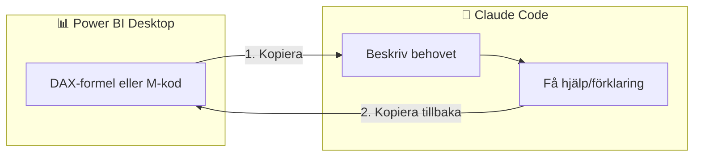

# Arbetsflöde: Claude Code och Power BI

Hur du praktiskt använder Claude Code för att få hjälp med DAX och Power Query.



---

## Det viktiga: .pbix är binärt

=== "Nybörjare"

    **Viktigt att veta:** Claude Code kan **inte** öppna eller läsa `.pbix`-filer direkt. De är komprimerade binärfiler.

    **Men det är inget problem!** Du arbetar istället genom att:

    1. Kopiera DAX-formler eller M-kod som text
    2. Klistra in i Claude Code
    3. Få hjälp och förklaringar
    4. Kopiera tillbaka resultatet till Power BI

=== "Standard"

    `.pbix`-filer är ZIP-arkiv med binära och XML-data. Claude Code kan inte tolka dem meningsfullt.

    **Arbetsflödet är kopiera/klistra:**

    | Från Power BI | Till Claude Code | Tillbaka |
    |---------------|------------------|----------|
    | DAX-formel | Beskriv + klistra | Kopiera ny formel |
    | M-kod | Advanced Editor → kopiera | Klistra i Advanced Editor |
    | Datamodell | Beskriv tabeller och relationer | - |

=== "Djupdykning"

    För avancerad användning: **Tabular Editor** kan exportera datamodellen som textbaserade scripts som kan versionshanteras i Git och granskas av Claude Code.

---

## Arbeta med DAX

### Skapa nya measures

**Din prompt till Claude Code:**
```
Jag har en Power BI-modell med:

Tabeller:
- Sales (Amount, Date, ProductID, CustomerID)
- Product (ProductID, ProductName, Category)
- Customer (CustomerID, Name, Region)
- Date (Date, Year, Month, Quarter) - markerad som datumtabell

Relationer:
- Sales[ProductID] → Product[ProductID]
- Sales[CustomerID] → Customer[CustomerID]
- Sales[Date] → Date[Date]

Skapa en measure som visar försäljning samma period förra året.
```

**Claude Code svarar med:**
```dax
Sales SPLY =
CALCULATE(
    SUM(Sales[Amount]),
    SAMEPERIODLASTYEAR('Date'[Date])
)
```

**Kopiera in i Power BI:**

1. Gå till **Modeling**-fliken
2. Klicka **New Measure**
3. Klistra in DAX-koden
4. Tryck **Enter**

---

### Felsöka befintliga measures

**Steg 1:** I Power BI, högerklicka på din measure → **Edit**

**Steg 2:** Kopiera hela formeln

**Steg 3:** Till Claude Code:
```
Denna DAX-formel ger fel resultat. Den visar samma siffra
för alla produkter när jag filtrerar:

Total Sales =
CALCULATE(
    SUM(Sales[Amount]),
    ALL(Product)
)

Förväntat: Olika siffror per produkt
Faktiskt: Samma siffra överallt

Vad är fel?
```

**Steg 4:** Kopiera korrigerad formel tillbaka

---

## Arbeta med Power Query (M-kod)

### Hitta M-koden

1. **Home** → **Transform data** (öppnar Power Query Editor)
2. Högerklicka på en query → **Advanced Editor**
3. Kopiera hela koden

**Exempel på M-kod:**
```m
let
    Source = Excel.Workbook(File.Contents("C:\data\sales.xlsx")),
    Sheet1 = Source{[Item="Sheet1",Kind="Sheet"]}[Data],
    PromotedHeaders = Table.PromoteHeaders(Sheet1)
in
    PromotedHeaders
```

### Be om hjälp med M-kod

**Din prompt:**
```
Jag har denna Power Query som läser en Excel-fil.
Jag vill lägga till:
1. Filtrera bort rader där Amount är null
2. Konvertera Date-kolumnen från text "20240115" till riktigt datum
3. Lägg till en kolumn YearMonth

[Klistra in din M-kod]
```

**Tillbaka i Power BI:**

1. Öppna **Advanced Editor**
2. Markera all befintlig kod
3. Klistra in den nya koden
4. Klicka **Done**
5. Verifiera i förhandsgranskningen
6. **Close & Apply**

---

## Beskriv din datamodell

=== "Nybörjare"

    För att Claude ska kunna hjälpa dig med DAX behöver den förstå din data. Beskriv alltid:

    - **Vilka tabeller** du har
    - **Vilka kolumner** som är relevanta
    - **Hur tabellerna hänger ihop** (relationer)

=== "Standard"

    **Mall för att beskriva datamodell:**

    ```
    TABELLER:
    - Sales (faktatabell)
      - Amount (decimal)
      - Quantity (heltal)
      - OrderDate (datum)
      - ProductKey (FK)
      - CustomerKey (FK)

    - Product (dimension)
      - ProductKey (PK)
      - ProductName
      - Category
      - SubCategory

    RELATIONER:
    - Sales[ProductKey] → Product[ProductKey] (många-till-en)
    - Sales[OrderDate] → Date[Date] (många-till-en)

    DATE-TABELL: Date (markerad som datumtabell)
    ```

=== "Djupdykning"

    **Exportera med Tabular Editor:**

    1. Installera [Tabular Editor](https://tabulareditor.github.io/)
    2. Anslut till öppen .pbix via **External Tools**
    3. Högerklicka på modellen → **Script entire model**
    4. Spara som .cs eller .json
    5. Skicka till Claude Code för granskning

---

## Vanliga DAX-mönster att be om

| Behov | Exempelprompt |
|-------|---------------|
| Tidsintelligens | "Skapa YTD (year-to-date) measure" |
| Jämförelse | "Visa förändring jämfört med förra året i procent" |
| Ranking | "Ranka produkter inom varje kategori" |
| Procent av total | "Visa varje regions andel av total försäljning" |
| Löpande summa | "Beräkna rolling 3-månaders genomsnitt" |
| Filtrering | "Summera bara för aktiva kunder" |

---

## Tips för bättre resultat

### Inkludera alltid

1. **Tabellnamn och kolumnnamn** - exakt som de heter i Power BI
2. **Datatyper** - "Amount är decimal", "Date är datetime"
3. **Relationer** - "Sales kopplas till Product via ProductKey"
4. **Önskat resultat** - "Ska visa 1500 för januari om jag filtrerar på Stockholm"

### Be om förklaringar

```
Förklara denna DAX rad för rad så jag förstår hur den fungerar:

[klistra in DAX]
```

### Visa exempel på fel

```
Formeln ger #ERROR. Här är measures som finns:
- Total Sales = SUM(Sales[Amount])
- Sales LY = CALCULATE([Total Sales], SAMEPERIODLASTYEAR(...))

Felmeddelandet säger: "A circular dependency was detected"
```

---

## Arbetsflöde sammanfattning

```
┌─────────────────┐
│   Power BI      │
│  Desktop        │
└────────┬────────┘
         │ Kopiera DAX/M-kod
         ▼
┌─────────────────┐
│  Claude Code    │
│  (beskriv +     │
│   klistra)      │
└────────┬────────┘
         │ Kopiera resultat
         ▼
┌─────────────────┐
│   Power BI      │
│  (klistra in)   │
└─────────────────┘
```

**Kom ihåg:** Du arbetar alltid med text (formler och kod), inte med filer!

---

## Nästa steg

Lär dig skriva [effektiv DAX med Claude](dax-med-claude.md) och se [best practices](best-practices.md).
