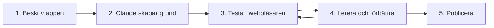

# Arbetsflöde: Claude Code och webbappar

Hur du praktiskt använder Claude Code för att bygga webbapplikationer steg för steg.

!!! abstract "Vad du kommer lära dig"
    - Det praktiska arbetsflödet för webbutveckling
    - Hur du itererar och förbättrar din app
    - Strukturera projekt för olika storlekar
    - Testa och felsöka med Claude

---

## Arbetsflödets steg



### 1. Beskriv vad du vill bygga

=== "Nybörjare"

    Beskriv din app i vardagliga termer:

    ```
    Jag vill ha en enkel att-göra-lista där jag kan:
    - Skriva in nya uppgifter
    - Markera uppgifter som klara
    - Ta bort uppgifter
    ```

=== "Standard"

    Var mer specifik om tekniska krav:

    ```
    Skapa en att-göra-app med:
    - Inputfält och "Lägg till"-knapp
    - Lista med checkbox för varje uppgift
    - Radera-knapp per uppgift
    - Sparar i localStorage
    - Använd Tailwind CSS för styling
    - Responsiv design för mobil
    ```

=== "Djupdykning"

    Specificera arkitektur:

    ```
    Skapa en todo-app med följande struktur:
    - Separata filer: index.html, styles.css, app.js
    - ES6 modules för JavaScript
    - Custom events för state-ändringar
    - BEM-notation för CSS-klasser
    - Accessibility: ARIA-labels, keyboard navigation
    ```

### 2. Claude skapar grunden

Claude genererar alla filer du behöver. För en enkel app kan allt vara i en HTML-fil:

```html
<!DOCTYPE html>
<html lang="sv">
<head>
    <meta charset="UTF-8">
    <title>Min Todo-app</title>
    <style>
        /* CSS här */
    </style>
</head>
<body>
    <!-- HTML här -->
    <script>
        // JavaScript här
    </script>
</body>
</html>
```

### 3. Testa i webbläsaren

=== "Nybörjare"

    1. Öppna filen i Utforskaren
    2. Dubbelklicka på `index.html`
    3. Webbläsaren öppnas med din app

=== "Standard"

    Använd en lokal server för bättre testning:

    ```bash
    # Med Python (finns ofta förinstallerat)
    python -m http.server 8000

    # Med Node.js
    npx serve

    # Öppna sedan http://localhost:8000
    ```

    **Fördelar med lokal server:**
    - JavaScript-moduler fungerar
    - Mer realistiska URL:er
    - Bättre felmeddelanden

### 4. Iterera och förbättra

**Be Claude om specifika ändringar:**

```
I min todo-app:
1. Lägg till ett filter så jag kan se "Alla", "Aktiva" eller "Klara"
2. Lägg till en räknare som visar hur många uppgifter som är kvar
3. Ändra färgen på klara uppgifter till grå
```

**Felsöka med Claude:**

```
Min app fungerar inte. När jag klickar "Lägg till" händer inget.
Här är koden: @index.html

Kan du hitta felet?
```

### 5. Publicera

Se [introduktionen](introduktion.md) för publiceringsalternativ som GitHub Pages.

---

## Projektstruktur

### Enkla appar (en fil)

För små projekt, håll allt i en fil:

```
min-app/
└── index.html    # HTML + CSS + JavaScript
```

**Fördelar:** Enkelt, lätt att dela, inga beroenden.

### Mellanstora appar (separata filer)

```
min-app/
├── index.html
├── css/
│   └── styles.css
├── js/
│   └── app.js
└── assets/
    └── images/
```

**Din prompt:**
```
Skapa en webbapp för receptsamling med separata filer för
HTML, CSS och JavaScript. Strukturen ska vara välorganiserad.
```

### Större appar (med byggverktyg)

```
min-app/
├── src/
│   ├── index.html
│   ├── components/
│   │   ├── Header.js
│   │   └── RecipeCard.js
│   ├── styles/
│   │   └── main.css
│   └── app.js
├── package.json
└── vite.config.js
```

**Din prompt:**
```
Sätt upp ett React-projekt med Vite för en receptsamling.
Inkludera grundläggande komponentstruktur.
```

---

## Vanliga uppgifter

### Lägg till interaktivitet

```
Lägg till så att användaren kan:
- Sortera listan A-Ö eller Ö-A
- Söka bland uppgifter i realtid
- Dra och släppa för att ändra ordning
```

### Spara data

=== "localStorage (enklast)"

    ```
    Spara todos i localStorage så de finns kvar efter sidladdning.
    ```

    **Resultat:**
    ```javascript
    // Spara
    localStorage.setItem('todos', JSON.stringify(todos));

    // Hämta
    const todos = JSON.parse(localStorage.getItem('todos')) || [];
    ```

=== "Backend API"

    ```
    Anslut appen till en backend. Använd fetch för att:
    - Hämta todos från /api/todos
    - Skapa nya med POST till /api/todos
    - Uppdatera med PUT till /api/todos/:id
    - Ta bort med DELETE till /api/todos/:id
    ```

### Responsiv design

```
Gör appen responsiv:
- På mobil (under 768px): En kolumn, större knappar
- På desktop: Sidopanel med filter, lista i mitten
- Behåll läsbarhet på alla skärmstorlekar
```

### Accessibility

```
Förbättra tillgängligheten:
- Lägg till ARIA-labels på knappar
- Se till att allt går att navigera med tangentbord
- Använd semantiska HTML-element (main, nav, button)
- Tillräcklig färgkontrast
```

---

## Felsökning

### Vanliga problem

??? question "JavaScript fungerar inte"

    1. Öppna **Developer Tools** (++f12++ eller högerklick → "Inspektera")
    2. Gå till **Console**-fliken
    3. Leta efter röda felmeddelanden
    4. Kopiera felet och fråga Claude:

    ```
    Jag får detta fel i konsolen:
    "Uncaught TypeError: Cannot read property 'addEventListener' of null"

    Här är min kod: @app.js
    ```

??? question "CSS påverkar inte elementet"

    1. Högerklick på elementet → "Inspektera"
    2. Kolla **Styles**-panelen till höger
    3. Se om din stil är överstruken (= överskriven)
    4. Fråga Claude:

    ```
    Min CSS för .todo-item fungerar inte. Elementet har fortfarande
    standardstil. Kan du kolla vad som är fel? @styles.css
    ```

??? question "Appen fungerar lokalt men inte publicerad"

    Vanliga orsaker:
    - **Sökvägar:** Använd relativa sökvägar (`./` istället för `/`)
    - **HTTPS:** Vissa API:er kräver HTTPS
    - **CORS:** Backend måste tillåta anrop från din domän

### Developer Tools

Lär dig använda webbläsarens utvecklarverktyg:

| Flik | Användning |
|------|------------|
| **Elements** | Inspektera och ändra HTML/CSS i realtid |
| **Console** | Se fel, köra JavaScript |
| **Network** | Se HTTP-anrop, identifiera långsamma resurser |
| **Sources** | Debugga JavaScript med breakpoints |
| **Application** | Se localStorage, cookies, cache |

**Be Claude förklara:**
```
Jag ser detta i Network-fliken:
[screenshot eller beskrivning]

Vad betyder det och hur fixar jag det?
```

---

## Tips för effektivt arbete

### Bygg stegvis

Börja med det enklaste som fungerar, sedan förbättra:

1. **Steg 1:** Statisk HTML-struktur
2. **Steg 2:** Grundläggande styling
3. **Steg 3:** En funktion i taget (lägg till, visa, ta bort)
4. **Steg 4:** Förbättringar (animationer, filter, sparning)

### Använd @-kommandon

```
Kolla @index.html och @app.js - varför fungerar inte
klick-händelsen på raderaknappen?
```

### Be om förklaringar

```
Förklara vad denna JavaScript gör rad för rad:
@app.js rad 15-30
```

### Versionhantera med Git

```
Initiera Git för detta projekt och gör en första commit.
```

Se [Git-kapitlet](../../04-git/vad-ar-git.md) för mer information.

---

## Prova själv

!!! example "Övning: Väderapp"

    Bygg en enkel väderapp steg för steg:

    **Steg 1 - Grund:**
    ```
    Skapa en väderapp som visar temperatur och väder för en stad.
    Börja med hårdkodade värden (Stockholm, 15°C, Soligt).
    ```

    **Steg 2 - Sökfält:**
    ```
    Lägg till ett sökfält där användaren kan skriva in en stad.
    När de söker, visa stadens namn i appen (fortfarande hårdkodade väder).
    ```

    **Steg 3 - Riktigt API (valfritt):**
    ```
    Anslut till OpenWeatherMap API för att hämta riktigt väder.
    API-nyckeln är: [din nyckel]
    ```

    **Steg 4 - Förbättringar:**
    ```
    Lägg till:
    - Ikon som visar vädertyp (sol, moln, regn)
    - Bakgrundsfärg som ändras med vädret
    - Senast sökte städer i localStorage
    ```

---

## Sammanfattning

!!! success "Det viktigaste att ta med sig"
    - **Beskriv → Generera → Testa → Iterera** är grundflödet
    - **Börja enkelt** - en HTML-fil räcker för små appar
    - **Developer Tools** (++f12++) är din bästa vän för felsökning
    - **Be om specifika ändringar** istället för att skriva om allt
    - **Spara med localStorage** för enkel datalagring
    - **Git** för att spåra ändringar och kunna ångra

---

## Nästa steg

Se [best practices](best-practices.md) för tips om kodkvalitet och underhåll.
